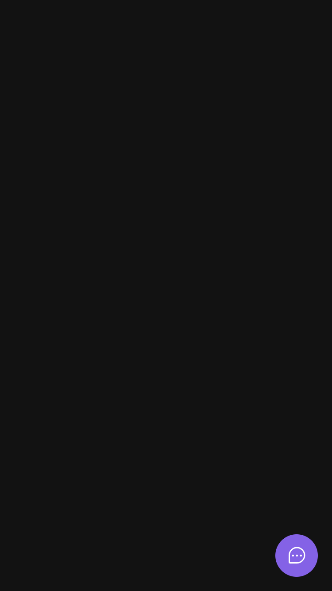
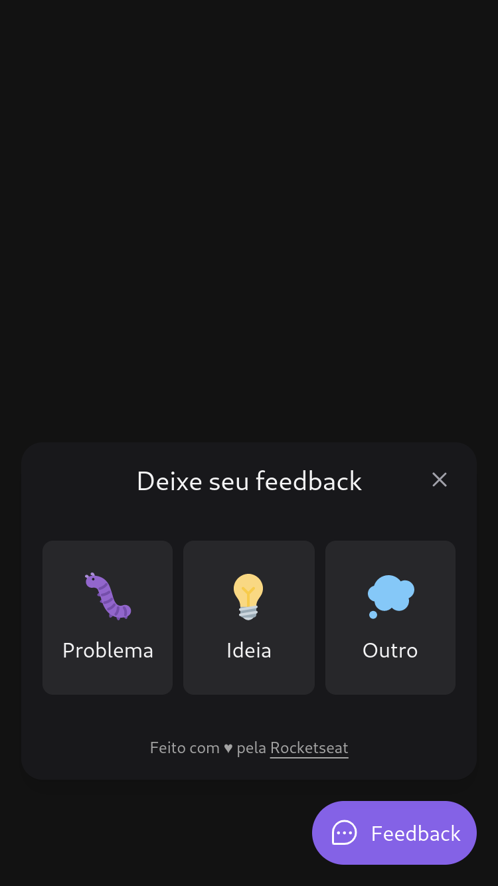
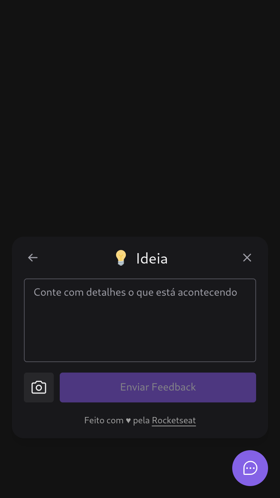
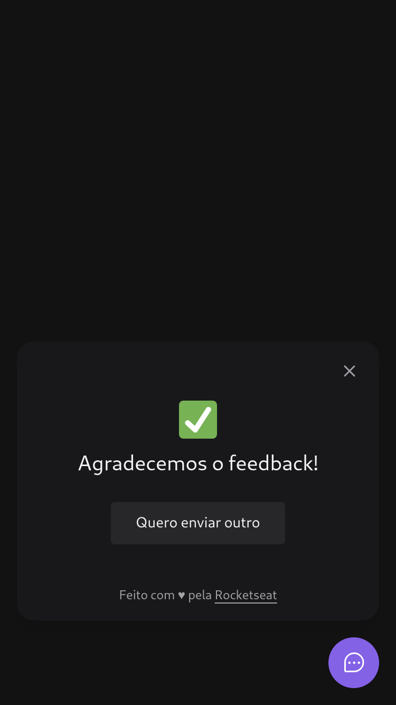

<h1 align="center">
    
</h1>
<h4 align="center">NLW Return Impulse</h4>

<p align="center">
  
  
  
  
  
  
  
</p>

<p align="center">
    
    
    
    
</p>

## How to use
To clone and run this project, you'll need **[Git](https://git-scm.com)**, **[node v14.20](https://nodejs.org/en/)** or higher + **[yarn v1.22.15](https://yarnpkg.com)** or higher installed on your computer. From your command line:
```bash
#Clone this repository
$ git clone https://github.com/RenanTRS/nlw-return

#Go into the repository
$ cd nlwreturn

#Install dependencies web (front-end)
$ cd web

$ yarn 
#or
$ npm i

#Install dependencies server (back-end)
$ cd server

$ yarn 
#or
$ npm i

#Run dev web (front-end)
$ yarn dev
#or
$ npm run dev

#Run dev server (back-end)
$ yarn dev
#or
$ npm run dev

#Build server (back-end)
$ yarn build
#or
$ npm run build

#Run build server (back-end)
$ yarn start
#ou
$ npm run start
```

## Built with  
<div>
    <div style="display:flex; gap:10%; justify-content:center; align-items:start">
        <table width="30%" style="text-align:center">
            <tr>
                <th style="text-align: center">Front-End</th>
            </tr>
            <tr>
                <td><a href="https://vitejs.dev/guide/#scaffolding-your-first-vite-project">Vite</a></td>
            </tr>
            <tr>
                <td>
                    <a href="https://reactjs.org/">
                        ReactJs
                    </a>
                </td>
            </tr>
            <tr>
                <td>
                    <a href="https://www.typescriptlang.org/">
                        Typescript
                    </a>
                </td>
            </tr>
            <tr>
                <td>
                    <a href="https://tailwindcss.com/docs/installation">
                        TailwindCss
                    </a>
                </td>
            </tr>
            <tr>
                <td>
                    <a href="https://headlessui.com/react/popover">
                        Popover headlessUi
                    </a>
                </td>
            </tr>
            <tr>
                <td>
                    <a href="https://axios-http.com/ptbr/docs/intro">
                        Axios
                    </a>
                </td>
            </tr>
            <tr>
                <td>
                    <a href="https://phosphoricons.com/">
                        PhosphorIcons
                    </a>
                </td>
            </tr>
            <tr>
                <td>
                    <a href="https://html2canvas.hertzen.com/">
                        Html2Canvas
                    </a>
                </td>
            </tr>
        </table>
        <table width="30%" style="text-align:center">
            <tr>
                <th style="text-align: center">
                    Back-End
                </th>
            </tr>
            <tr>
                <td>
                    <a href="https://nodejs.org/en/">
                        NodeJS
                    </a>
                </td>
            </tr>
            <tr>
                <td>
                    <a href="https://www.typescriptlang.org/">
                        Typescript
                    </a>
                </td>
            </tr>
            <tr>
                <td>
                    <a href="https://expressjs.com/pt-br/">
                        Express
                    </a>
                </td>
            </tr>
            <tr>
                <td>
                    <a href="https://www.npmjs.com/package/cors">
                        Cors
                    </a>
                </td>
            </tr>
            <tr>
                <td>
                    <a href="https://www.prisma.io/">
                        Prisma
                    </a>
                </td>
            </tr>
            <tr>
                <td>
                    <a href="https://nodemailer.com/about/">
                        Nodemailer
                    </a>
                </td>
            </tr>
            <tr>
                <td>
                    <a href="https://jestjs.io/pt-BR/docs/getting-started">
                        Jest
                    </a>
                </td>
            </tr>
            <tr>
                <td>
                    <a href="https://swc.rs/docs/usage/jest">
                        SWC
                    </a>
                </td>
            </tr>
        </table>
    </div>
</div>


## Contact
- Email me - renantrsouza@gmail.com  
- Connect with me on [LinkedIn](https://www.linkedin.com/in/renantrsouza/)

## License
This project is licensed under the MIT License - see the [LICENSE](https://github.com/renantrs/nlw-return/blob/main/LICENSE) file for details.