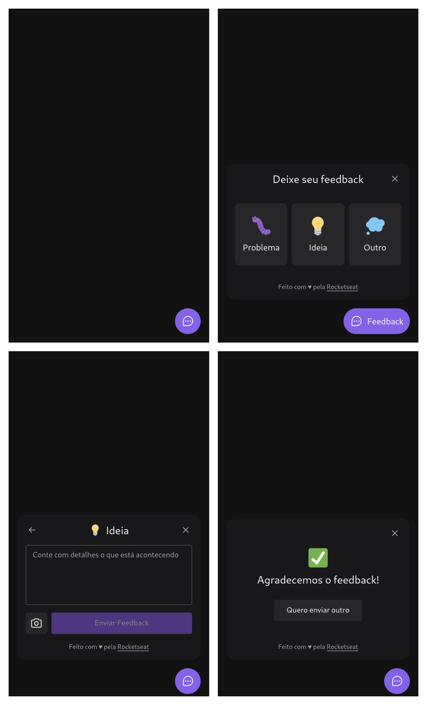

<h1 align="center">
    
</h1>
<h4 align="center">NLW Return Impulse</h4>

<p align="center">
  
  
  
  
  
  
  
</p>

<p align="center">
    
</p>

## How to use
To clone and run this project, you'll need **[Git](https://git-scm.com)**, **[node v14.20](https://nodejs.org/en/)** or higher + **[yarn v1.22.15](https://yarnpkg.com)** or higher installed on your computer. From your command line:
```bash
#Clone this repository
$ git clone https://github.com/RenanTRS/nlw-return

#Go into the repository
$ cd nlwreturn

#Install dependencies web (front-end)
$ cd web

$ yarn 
#or
$ npm i

#Install dependencies server (back-end)
$ cd server

$ yarn 
#or
$ npm i

#Run dev web (front-end)
$ yarn dev
#or
$ npm run dev

#Run dev server (back-end)
$ yarn dev
#or
$ npm run dev

#Build server (back-end)
$ yarn build
#or
$ npm run build

#Run build server (back-end)
$ yarn start
#ou
$ npm run start
```

## Built with  
<center>

| Front-End | | | Back-end |
| :------------------:|:----------:|:----------:|:----------:|
| [Vite](https://vitejs.dev/guide/#scaffolding-your-first-vite-project)| | |[NodeJs](https://nodejs.org/en/)|
| [ReactJs](https://reactjs.org/)| | |[Typescript](https://www.typescriptlang.org/)|
| [Typescript](https://www.typescriptlang.org/)| | |[Express](https://expressjs.com/pt-br/)|
| [TailwindCss](https://tailwindcss.com/docs/installation)| | |[Cors](https://www.npmjs.com/package/cors)|
| [Popover-headlessUI](https://headlessui.com/react/popover)| | |[Prisma](https://www.prisma.io/)|
| [Axios](https://axios-http.com/ptbr/docs/intro)| | |[Nodemailer](https://nodemailer.com/about/)|
| [PhosphorIcons](https://phosphoricons.com/)| | |[Jest](https://jestjs.io/pt-BR/docs/getting-started)|
| [Html2Canvas](https://html2canvas.hertzen.com/)| | |[SWC](https://swc.rs/docs/usage/jest)|

</center>

## Contact
- Email me - renantrsouza@gmail.com  
- Connect with me on [LinkedIn](https://www.linkedin.com/in/renantrsouza/)

## License
This project is licensed under the MIT License - see the [LICENSE](https://github.com/renantrs/nlw-return/blob/main/LICENSE) file for details.